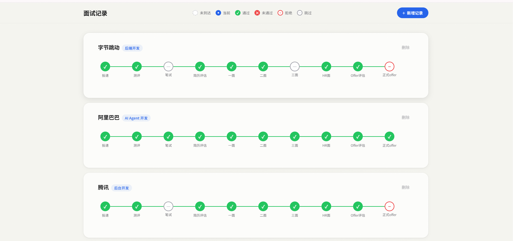

# 面试记录管理器 / Interview Manager


轻量级求职面试进度追踪工具，帮你同时管理多家公司的面试流程，用可视化时间线清晰呈现每个阶段的状态。



---

## 为什么用这个

求职季投了十几家公司，每家的进度各不相同——这家在等一面结果、那家刚做完测评、另一家已经拿到 Offer。光靠脑子记根本记不住。

这个工具把每家公司的面试进度摊开看，一眼就知道「还有几家需要我推进」「挂了几个」「拿到几个 Offer」，不焦虑、不错过关键节点。

---

## 功能特性

- **📊 求职统计看板** — 投递总数、进行中、Offer数、已挂、已拒、面试转化率，一眼看清求职全局
- **📋 卡片式时间线** — 每家公司独立卡片，10 阶段时间线从投递到正式 Offer
- **🎨 6 种阶段状态** — 待处理、当前进行中、通过、未通过、拒绝、已跳过，各有独立视觉样式
- **⚡ 智能推进** — 点击当前阶段节点即可弹出操作面板，通过/未通过/跳过/拒绝一键切换，通过后自动推进下一阶段
- **🔍 搜索与排序** — 按公司名或职位搜索，支持按时间、名称、进度排序
- **📝 自动补全** — 内置 35+ 知名科技公司和常见职位名称
- **⌨️ 键盘操作** — Enter、方向键、Escape 完成所有操作，时间线节点支持键盘焦点
- **💾 数据持久化** — 数据保存到本地 JSON 文件，重启不丢失；支持导入导出备份
- **♿ 无障碍** — 键盘焦点环、屏幕阅读器标签、支持减少动效偏好
- **🔒 数据安全** — 原子写入防损坏、写入串行化防并发覆盖

---

## 快速开始

### 一键启动（推荐）

| 系统 | 方式 |
|------|------|
| Windows | 双击 `start.bat` |
| Mac / Linux | 终端运行 `./start.sh` |

脚本会自动完成：检测 Node.js 环境、安装依赖、启动前后端。启动后访问 **http://localhost:5173**。

> 无需任何技术背景，双击即用。

### 手动启动（开发者）

```bash
git clone https://github.com/<your-username>/InterviewManager.git
cd InterviewManager
npm install
npm run dev
```

访问 **http://localhost:5173**

### 生产部署

```bash
npm run build
npm start
```

访问 **http://localhost:3001**（可通过 `PORT` 环境变量自定义端口）

---

## 技术栈

| 层 | 技术 |
|---|---|
| 前端框架 | Vue 3 + Composition API + TypeScript |
| 构建工具 | Vite 6 |
| 后端 | Express 4 + TypeScript |
| 数据存储 | 本地 JSON 文件 |
| 样式 | 纯手写 CSS，Apple 风格暖色调 |

---

## 项目结构

```
├── index.html                  # Vite 入口
├── package.json
├── dev.cjs                     # 一键开发启动脚本
├── tsconfig.json               # 前端 TypeScript 配置
├── tsconfig.server.json        # 服务端 TypeScript 配置
├── vite.config.ts              # Vite 配置（开发代理 /api）
├── vitest.config.ts            # 测试配置
├── server/                     # 后端 API
│   ├── index.ts                # Express 入口（端口 3001）
│   ├── routes.ts               # REST API 路由（含输入校验）
│   ├── data.ts                 # JSON 文件读写（原子写入 + 串行化）
│   ├── types.ts                # 数据模型
│   └── __tests__/              # 后端测试（34 用例）
├── src/                        # 前端 Vue 应用
│   ├── main.ts                 # Vue 入口
│   ├── App.vue                 # 根组件（状态管理、键盘事件）
│   ├── api.ts                  # API 客户端
│   ├── types.ts                # 前端类型定义
│   ├── assets/styles/          # 全局样式与模态框样式
│   └── components/             # Vue 组件
│       ├── TopBar.vue          # 导航栏（搜索/排序/导入导出）
│       ├── StatsPanel.vue      # 求职统计看板
│       ├── InterviewCard.vue   # 面试卡片（时间线容器）
│       ├── TimelineNode.vue    # 时间线节点
│       ├── ActionPopover.vue   # 阶段状态操作弹窗
│       ├── AddModal.vue        # 新增记录弹窗（含自动补全）
│       ├── EditModal.vue       # 编辑记录弹窗
│       ├── ConfirmDialog.vue   # 删除确认对话框
│       ├── EmptyState.vue      # 空状态占位
│       └── Toast.vue           # Toast 通知
├── data/                       # 数据存储目录（gitignore）
├── start.bat / start.ps1       # Windows 启动脚本
├── start.sh                    # Mac/Linux 启动脚本
└── LICENSE                     # MIT 许可证
```

---

## 统计指标说明

统计面板展示的 6 个指标专为求职场景设计：

| 指标 | 含义 |
|------|------|
| 投递总数 | 累计投递家数 |
| 进行中 | 仍在推进中（有未完成的当前阶段） |
| Offer | 拿到正式 Offer 的家数（最后阶段为"通过"） |
| 已挂 | 公司未通过你（任一阶段"未通过"） |
| 已拒 | 你自己拒绝了公司（任一阶段"拒绝"） |
| 面试转化率 | 投递后进入面试阶段的比例（衡量简历竞争力） |

---

## API 文档

| 方法 | 路径 | 说明 |
|------|------|------|
| GET | `/api/interviews` | 获取所有面试记录 |
| POST | `/api/interviews` | 新增记录 `{company, position}` |
| PATCH | `/api/interviews/:id` | 编辑公司名和职位 `{company, position}` |
| PATCH | `/api/interviews/:id/stage` | 更新阶段状态 `{stageIndex, status}` |
| DELETE | `/api/interviews/:id` | 删除记录 |
| GET | `/api/interviews/export` | 导出所有数据为 JSON 文件 |
| POST | `/api/interviews/import` | 从 JSON 导入数据（自动去重） |
| GET | `/api/interviews/health` | 健康检查 |

---

## 配置

| 环境变量 | 默认值 | 说明 |
|---------|-------|------|
| PORT | 3001 | 服务器端口号 |
| DATA_DIR | `./data` | 数据存储目录 |
| DATA_FILE | `./data/interviews.json` | 数据文件路径 |

---

## 开发命令

```bash
npm run dev          # 同时启动前后端（开发模式，热更新）
npm run dev:server   # 单独启动后端
npm run dev:client   # 单独启动前端
npm run build        # 构建生产版本
npm start            # 启动生产服务器
npm run preview      # 构建并启动（一步完成）
npm run test         # 运行测试
```

---

## 许可证

本项目基于 [MIT](LICENSE) 许可证开源。

---

## English

A lightweight job interview progress tracker that helps you manage multiple company interviews simultaneously with a visual timeline.

**Features:** statistics dashboard (offers / failures / conversion rate), 10-stage timeline, 6 stage statuses, smart auto-advance, autocomplete for 35+ tech companies, full keyboard navigation, toast notifications, import/export backup, data persistence.

**Quick Start:**

```bash
git clone https://github.com/<your-username>/InterviewManager.git
cd InterviewManager
npm install
npm run dev
```

Open http://localhost:5173. See the [Chinese documentation](#功能特性) for full details.
